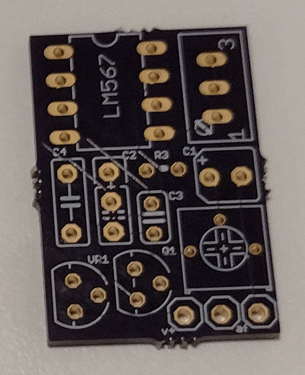
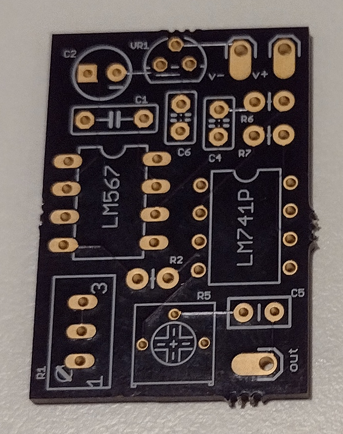

# Eagle CAD Projects

Two tone encoder boards for older 2 Meter radios, that have a tone switch but require an optional board.

## Prototypes

These were made by [Osh Park](https://oshpark.com).

* [Simple Tone Encoder](SimpleEncoder)

* [Tone Encoder](ToneEncoder)

## Assembly and Testing

* Todo

## Conversion to KiCad

* Todo