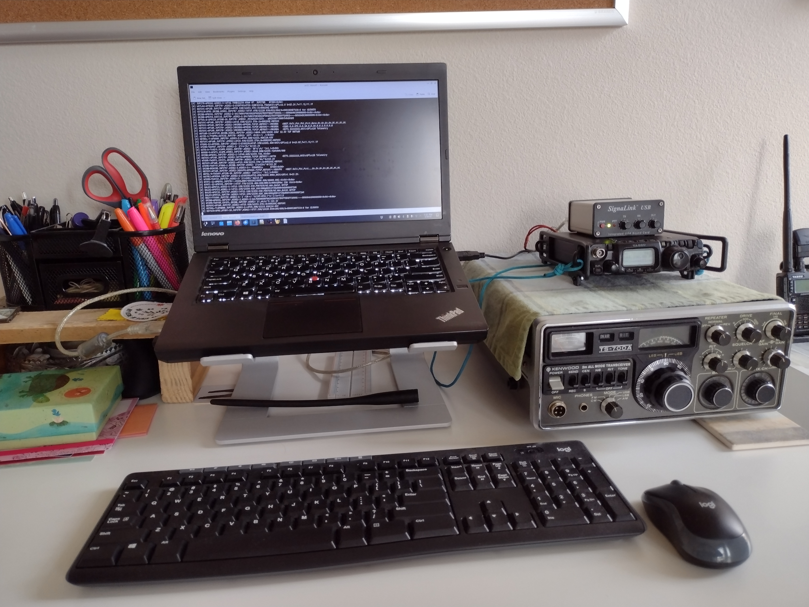
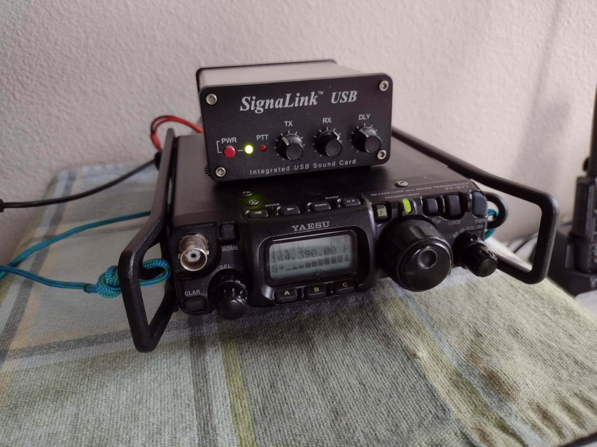
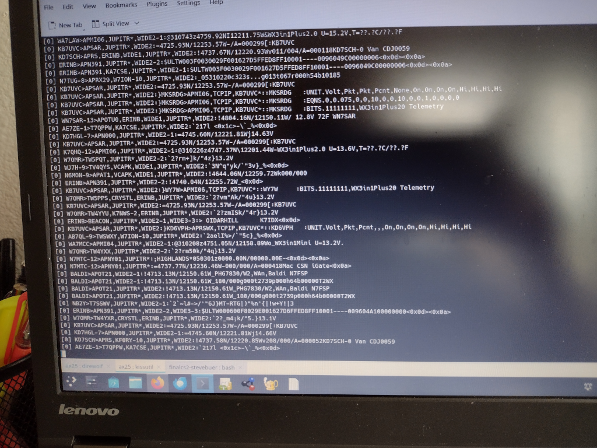
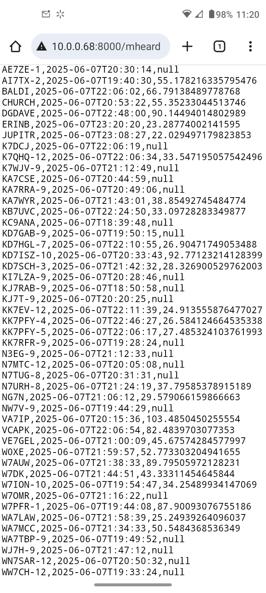
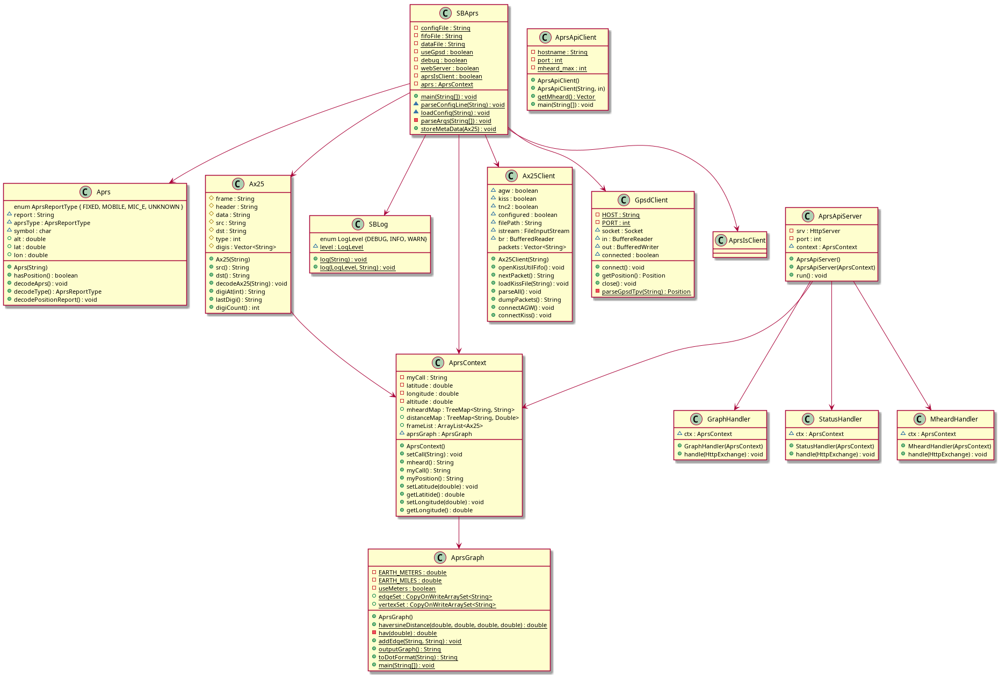
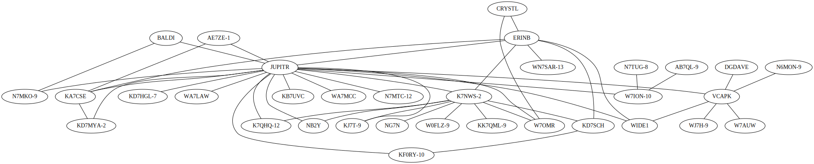

# CS143 Final Project

## SBAprs

The goal of this project is to demonstrate the skills learned in the CS143 course by
developing a small program to store and analyze ham radio Automatic Packet Reporting
System (APRS) reports received over the air at the user's location.

## Hardware

* Radio
* Sound card interface
* USB GPS receiver

 


## Configuration and Operation

The program is designed to read AX.25 data packets as they are received over the air in real-time and demodulated 
by a software modem application called <a href="https://github.com/wb2osz/direwolf">Direwolf</a>. For the 
initial implementation of this project the data packets were converted to a text string form by a program
that comes with direwolf called *kissutil*. Lines from this program were redirected into a Linux FIFO and
read from the other end by SBAprs. SBAprs can also read in packets in the same text format (known as
TNC2 format) from a text file for testing or off-line analysis. The output of the program is returned via
HTTP request with the intent of the data being displayed on an Android App. The API is provided via:

* http://localhost:8000/mheard
* http://localhost:8000/graph
* http://localhost:8000/status

I was able to view the output on my phone's web browser, but it is a poor substitute for an App.



The **mheard** command is a standard command on most packet radio terminal node controller (TNC) equipment
going back to the 1980s. I believe it stands for 'monitor heard' and usually lists the most recently heard
AX.25 packets or *frames* as they are often called. In my variant of this command, the callsign and most
recent timestamp are listed -- as well as a distance to the node if a GPS position report is available from
that station.

The **graph** command returns a graphviz dot file suitable for rendering into an unidirected graph of the
logical packet radio network based on the path a packet took through the network. AX.25 packet radio allows
packets to be forwarded through several hops of network nodes. This network path is contained in the packet
header and in the SBAprs program it is used to create graph edges for mapping the RF network links. A [utility
script](util/showgraph.sh) is available to fetch the dot file and convert it to an SVG file. In a future release
I would like to be able to return the SVG directly in the HTTP request.

The **status** page is intended to give summary statistics about the program operation and overall network being
monitored. It is a work in progress.

There are several variables that are set through a [config file](config/SBAprs.cfg). The variables are:

* MYCALL \<callsign>
* GPSD \<TRUE|FALSE>
* LAT \<latitude>
* LON \<longitude>
* DATAFILE \<filename>

There are also some command-line options that can be passed to the program at run time.

* -d for debug mode
* -w to start the web API server

The fifo from which to read packets was started with the following commands:

```
mkfifo /tmp/sbaprs.fifo
kissutil 1> /tmp/sbaprs.fifo
```

### Classes

The program is implemented using about a dozen classes, the design of which was not very well planned up front.
Because of the experimental nature of this program and the hobby in general, the structure of the program evolved
rapidly over a several week period. Future releases would benefit greatly from re-factoring of the design. However,
this existing class structure is described in the following diagram, generated from a PlantUML file.



#### Data Structures and Programming Idioms

One of the considerations in choosing data structures was whether or not they were thread-safe for a particular use,
because the processing of input and generation of output occur in separate threads. The final implementation will use
a third thread for receiving GPS location data while in motion. Some of those data structures are:

* Vector\<Strings> digis in class Ax25: this represents the list of digipeaters the packet passed through. This implementation
  of the List interface claims to be thread safe.
* TreeMap\<String, String> mheardMap and TreeMap\<String, Double> distanceMap in class AprsContext: these maps store the data
  for the mheard list. This needs to be changed to something threadsafe. 
* CopyOnWriteArraySet\<String> edgeSet in class AprsGraph: set of edges for the node graph.
* forEach w/ lamda in AprsContext::mheard()

### Program Output

The intent of the program was, and still is, to provide data for an Android app to display -- specifically an Android
Auto app. Android Studio has a fairly steep learning curve, and that part of the project is just a skeleton at this point.
However, the web API does provide the following:

* A list of all stations heard, with their last timestamp, and a calculated distance for packets that contain a position report (not all do)
* network graph in graphviz .dot format that can be rendered into an SVG with the graphviz package
* stats page that provides some summary information about the network

Here is an example [mheard csv output](output/mheard-output.csv), graphviz [dot file](output/graph.dot), and graphviz [svg file](output/graph.svg).



### Testing 

Test data was initially gathered from over-the-air signals on 144.39 Mhz in the Poulsbo, WA and stored in the 
file [2m-packet.txt] (test-data/2m-packet.txt) for development. The mheard and graphviz files above were generated from live data with
the system running for about 4 hours at my desk. 

### Challenges

There were several challenges with this project including a broad scope, lots of interacting 
software components, and unfamiliar subject areas such as threads. I am definitely planning 
to finish the Android App, but learning Android Studio is a project in and of itself. I think 
it might actually be easier to learn enough Kotlin to write the App rather than forging ahead
with the Android Java API.

### Resources and References

* [AX.25 Protocol](https://www.ax25.net/AX25.2.2-Jul%2098-2.pdf)
* [APRS Protocol](https://www.aprs.org/doc/APRS101.PDF)
* [Apache Ant](https://ant.apache.org/manual/index.html)
* [Haversine Distance](https://www.movable-type.co.uk/scripts/latlong.html)
* [GPSD Client HowTo](https://gpsd.gitlab.io/gpsd/client-howto.html)
* [PlantUML manual](https://plantuml.com/class-diagram)

### To Do List

* Thread safe maps
* Android App
* Gpsd integration
* A lot of details
